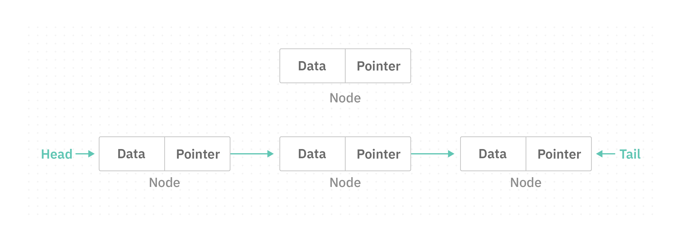
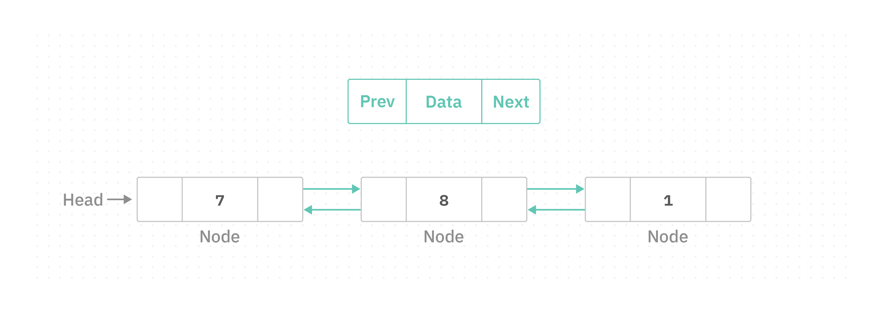
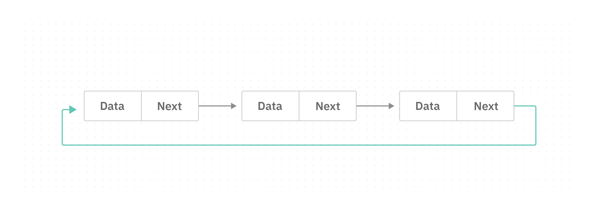
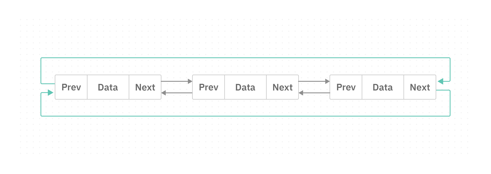

# Introduction to Linked List

Imagine you are on a treasure hunt with a series of cards leading you to the hidden gold. The cards are arranged in links to guide you on the path.

Let's say there are two cards in the treasure hunt. The first card would contain the information about card 1 and a reference to the next card. The second card would hold the information about card 2 and have an empty reference since it's the last card in the treasure hunt.

To simulate the treasure hunt in our program, we need to use a `linked list` to represent the sequence of cards, each card is like a `node`. Each node **contains two parts**, the `data`(information) about the card itself and a `pointer`(or reference) to the next card in the list.

## Concept
A `linked list` is a **data structure** that consists of a **sequence of elements called nodes**. The first node in the list is called the `head`, and the last node is called the `tail`.




## Types of Linked List
* `Single linked list`: A type of linked list that is unidirectional; it can be traversed in only **one direction** from `head` to the last node `tail`.
     
* `Double linked list`: It is a special type of linked list where each node contains a **pointer to the previous** node as well as the next node of the linked 
   list.
  
* `Circular linked list`: Is a type of linked list in which the first and the last nodes are also **connected** to each other to form a circle.


### Single Linked List
It is the simplest type, where each node is linked to the next. 


#### Primitive Type
To start implementing a linked list, we will need the `Node` class to build our slice first:

```java
class Node {
    int data;
    Node next;

    Node(int data) {
        this.data = data;
        this.next = null;
    }
}
``` 
Now, after creating the slice, which is our building block, let's create another class that is responsable to build the complete single-linked list data structure to link our nodes together and perform operations on it:

```java

class LinkedList {
    private Node head;

    LinkedList() {
        this.head = null;
    }

    void insert(int data) {
        Node newNode = new Node(data);
        if (head == null) {
            head = newNode;
        } else {
            Node current = head;
            while (current.next != null) {
                current = current.next;
            }
            current.next = newNode;
        }
    }

    void display() {
        if (head == null) {
            System.out.println("Linked list is empty.");
        } else {
            Node current = head;
            while (current != null) {
                System.out.println(current.data);
                current = current.next;
            }
        }
    }
}
```
Now, let's implement the `Main` class and create our linked list with real values:

```java
public class Main {
    public static void main(String[] args) {
        LinkedList linkedList = new LinkedList();
        linkedList.insert(1);
        linkedList.insert(2);
        linkedList.insert(3);
        linkedList.display();
    }
}
```

Output:

```
1
2
3
```
#### Non-primitive Type
In Java, `String` is a non-primitive type. Therefore, we will implement the single-linked list with the `String` data type.

```java
public class Main {
    public static void main(String[] args) {
        LinkedList linkedList = new LinkedList();
        linkedList.insert("LAMA");
        linkedList.insert("SARA");
        linkedList.insert("EMAN");
        linkedList.display();
    }
}

class Node {
    String data;
    Node next;

    Node(String data) {
        this.data = data;
        this.next = null;
    }
}

class LinkedList {
    private Node head;

    LinkedList() {
        this.head = null;
    }

    void insert(String data) {
        Node newNode = new Node(data);
        if (head == null) {
            head = newNode;
        } else {
            Node current = head;
            while (current.next != null) {
                current = current.next;
            }
            current.next = newNode;
        }
    }

    void display() {
        if (head == null) {
            System.out.println("Linked list is empty.");
        } else {
            Node current = head;
            while (current != null) {
                System.out.println(current.data);
                current = current.next;
            }
        }
    }
}
```

Output: 
```
LAMA
SARA
EMAN
```

To create a generic linked list, we will replace the type with  `<T>` as a placeholder.

```java
public class Main {
    public static void main(String[] args) {
        LinkedList<String> linkedList = new LinkedList<>();
        linkedList.insert("LAMA");
        linkedList.insert("SARA");
        linkedList.insert("EMAN");
        linkedList.display();
    }
}

class Node<T> {
    T data;
    Node<T> next;

    Node(T data) {
        this.data = data;
        this.next = null;
    }
}

class LinkedList<T> {
    private Node<T> head;

    LinkedList() {
        this.head = null;
    }

    void insert(T data) {
        Node<T> newNode = new Node<>(data);
        if (head == null) {
            head = newNode;
        } else {
            Node<T> current = head;
            while (current.next != null) {
                current = current.next;
            }
            current.next = newNode;
        }
    }

    void display() {
        if (head == null) {
            System.out.println("Linked list is empty.");
        } else {
            Node<T> current = head;
            while (current != null) {
                System.out.println(current.data);
                current = current.next;
            }
        }
    }
}
```

Output:
```
LAMA
SARA
EMAN
```

### Double Linked List

A double-linked list is an enhanced version that allows **bidirectional traversal**. Each `node` in a **double-linked list** contains an additional pointer called `previous`, which points to the previous node in the list. This feature enables efficient **traversal** both **forward and backward** through the list. Unlike singly linked lists, where traversal is only possible in one direction.



#### Primitive Type

The slice now has three parts. The data, next, and previous:

```java
class Node {
    int data;
    Node previous;
    Node next;

    Node(int data) {
        this.data = data;
        this.previous = null;
        this.next = null;
    }
}
```
The `DoublyLinkedList` class with insert, delete, and display operations:

```java
class DoublyLinkedList {
    private Node head;

    public void insert(int data) {
        Node newNode = new Node(data);
        if (head == null) {
            head = newNode;
        } else {
            Node current = head;
            while (current.next != null) {
                current = current.next;
            }
            newNode.previous = current;
            current.next = newNode;
        }
    }

    public void delete(int data) {
        if (head == null) return;

        Node current = head;
        while (current != null) {
            if (current.data == data) {
                if (current.previous == null) {
                    // Node to delete is the head
                    head = current.next;
                    if (head != null) {
                        head.previous = null;
                    }
                } else {
                    // Node to delete is not the head
                    current.previous.next = current.next;
                    if (current.next != null) {
                        current.next.previous = current.previous;
                    }
                }
                break;
            }
            current = current.next;
        }
    }

    public void display() {
        Node current = head;
        while (current != null) {
            System.out.print(current.data + " ");
            current = current.next;
        }
        System.out.println();
    }
}
```

The `Main` class:
```java
public class Main {
    public static void main(String[] args) {
        DoublyLinkedList doublyList = new DoublyLinkedList();
        doublyList.insert(7);
        doublyList.insert(14);
        doublyList.insert(21);

        System.out.println("Original list:");
        doublyList.display();

        doublyList.delete(14);
        System.out.println("List after deleting 14:");
        doublyList.display();
    }
}
```
Output:
```
Original list:
7 14 21
List after deleting 14:
7 21
```

#### Non-primitive Type

```java
public class Main {
    public static void main(String[] args) {
        DoublyLinkedList doublyList = new DoublyLinkedList();
        doublyList.insert("LAMA");
        doublyList.insert("SARA");
        doublyList.insert("EMAN");

        System.out.println("Original list:");
        doublyList.display();

        doublyList.delete("SARA");
        System.out.println("List after deleting SARA:");
        doublyList.display();
    }
}

class Node {
    String data;
    Node previous;
    Node next;

    Node(String data) {
        this.data = data;
        this.previous = null;
        this.next = null;
    }
}

class DoublyLinkedList {
    private Node head;

    public void insert(String data) {
        Node newNode = new Node(data);
        if (head == null) {
            head = newNode;
        } else {
            Node current = head;
            while (current.next != null) {
                current = current.next;
            }
            newNode.previous = current;
            current.next = newNode;
        }
    }

    public void delete(String data) {
        if (head == null) return;

        Node current = head;
        while (current != null) {
            if (current.data.equals(data)) {
                if (current.previous == null) {
                    head = current.next;
                    if (head != null) {
                        head.previous = null;
                    }
                } else {
                    current.previous.next = current.next;
                    if (current.next != null) {
                        current.next.previous = current.previous;
                    }
                }
                break;
            }
            current = current.next;
        }
    }

    public void display() {
        Node current = head;
        while (current != null) {
            System.out.print(current.data + " ");
            current = current.next;
        }
        System.out.println();
    }
}
```

Output:
```
Original list:
LAMA SARA EMAN
List after deleting SARA:
LAMA EMAN
```

### Circular Linked List
A **circular linked list** is a type of linked list in which the last node is connected back to the first node, forming a circle. There are two types:

- **Circular Single Linked List**: The last node's next pointer points back to the head node.
  



- **Circular Double Linked List**: The last node points to the first node, and the first node also points back to the last node, creating a circular reference in both directions.
    


#### Primitive Type

The slice is the same as the single linked list; the circularity is handled in the insert logic:
```java
class Node {
    int data;
    Node next;

    Node(int data) {
        this.data = data;
        this.next = null;
    }
}
```

The `CircularLinkedList` class:

```java
class CircularLinkedList {
    private Node head;

    CircularLinkedList() {
        head = null;
    }

    public void insert(int value) {
        Node newNode = new Node(value);
        if (head == null) {
            head = newNode;
            newNode.next = head; // points to itself (circularity)
        } else {
            Node current = head;
            while (current.next != head) {
                current = current.next;
            }
            current.next = newNode;
            newNode.next = head; // points back to head
        }
    }

    public void display() {
        if (head == null) {
            System.out.println("Circular linked list is empty.");
            return;
        }
        Node current = head;
        do {
            System.out.print(current.data + " ");
            current = current.next;
        } while (current != head);
        System.out.println();
    }
}
```

Now create the circular linked list with real values:
```java
public class Main {
    public static void main(String[] args) {
        CircularLinkedList circularLinkedList = new CircularLinkedList();
        circularLinkedList.insert(1);
        circularLinkedList.insert(2);
        circularLinkedList.insert(3);
        circularLinkedList.insert(4);
        System.out.println("Circular linked list:");
        circularLinkedList.display();
    }
}
```

Output:
```
Circular linked list:
1 2 3 4
```

#### Non-primitive Type

```java
public class Main {
    public static void main(String[] args) {
        CircularLinkedList circularLinkedList = new CircularLinkedList();
        circularLinkedList.insert("LAMA");
        circularLinkedList.insert("SARA");
        circularLinkedList.insert("EMAN");
        circularLinkedList.insert("HANA");
        System.out.println("Circular linked list:");
        circularLinkedList.display();
    }
}

class Node {
    String data;
    Node next;

    Node(String data) {
        this.data = data;
        this.next = null;
    }
}

class CircularLinkedList {
    private Node head;

    CircularLinkedList() {
        head = null;
    }

    public void insert(String value) {
        Node newNode = new Node(value);
        if (head == null) {
            head = newNode;
            newNode.next = head;
        } else {
            Node current = head;
            while (current.next != head) {
                current = current.next;
            }
            current.next = newNode;
            newNode.next = head;
        }
    }

    public void display() {
        if (head == null) {
            System.out.println("Circular linked list is empty.");
            return;
        }
        Node current = head;
        do {
            System.out.print(current.data + " ");
            current = current.next;
        } while (current != head);
        System.out.println();
    }
}
```

Output:
```
Circular linked list:
LAMA SARA EMAN HANA
```

## Practice
- Create a double-linked list of strings containing "A", "B", and "C".
  - Display the list
  - Delete "B"
  - Display the list again
