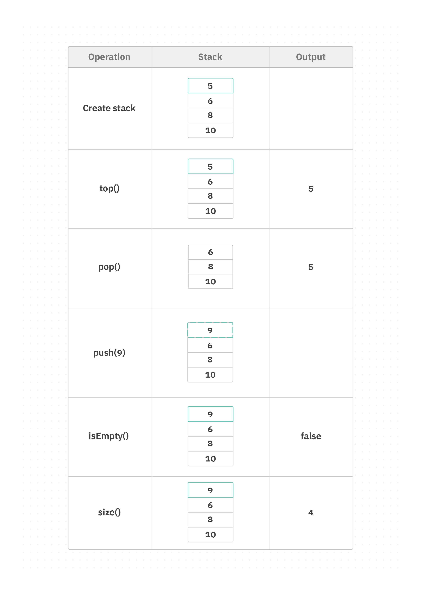

# Stack
Imagine you have a stack of books on your desk. Each book is placed on top of the previous one. When you want to **add a new book** to the stack, you put it **on top**. And when you want to **remove a book**, you take the one **from the top**.

In computer programming, a stack is similar to this stack of books. It is a data structure that follows the same idea. Instead of books, we have a stack of data. We can add new data on top of the stack, and when we want to remove data, we take the one from the top.

## Concept
A **stack** is a fundamental data structure that stores data in a specific order, where items can **only be added or removed from the top**.
- In a stack, the most recently added item is always at the top, and it is the first item to be removed. This behavior is known as **"last in, first out" (LIFO)**.
- A stack typically supports the following operations:
  - `top()`: return the top element from the stack without removing it.
  - `pop()`: remove the top element from the stack and return it.
  - `push(x)`: add element x to top of stack.
  - `isEmpty()`: return true if the stack is empty.
  - `size()`: return the size of the stack.




## Implementation
To implement a stack, you can use an array or a linked list. Previously, we learned about the characteristics of each of them, and now let's explore how the implementation of a stack can differ for each of them.

Both array-based and linked list-based implementations have their advantages and trade-offs. The choice between them depends on factors such as the expected size of the stack, memory requirements, and the specific needs of your application.

### Stack using Array
Create a class called `StackArray` with a constructor to initialize the array and the top index value to `-1` (empty stack).
```java
class StackArray {
    private int[] data; // Array to store the stack elements
    private int top; // Index of the top element in the stack
    private int size; // Size of the stack

    public StackArray(int size) {
        data = new int[size];
        top = -1; // Initialize the top index to -1 (empty stack)
        this.size = size;
    }
}
```

Now let's add the methods `top`, `pop`, `push`, `isEmpty`, and `size`.
```java
class StackArray {
    private int[] data; // Array to store the stack elements
    private int top; // Index of the top element in the stack
    private int size; // Size of the stack

    public StackArray(int size) {
        data = new int[size];
        top = -1; // Initialize the top index to -1 (empty stack)
        this.size = size;
    }
    public void push(int value) {
        if (top == size - 1) {
            System.out.println("Stack is full.");
            return;
        }
        data[++top] = value; // Increment top and add the element to the stack
    }

    public int pop() {
        if (top == -1) {
            System.out.println("Stack is empty.");
            return -1;
        }
        int value = data[top]; // store the actual top value
        top--;                 // remove the element
        return value;          // return the removed value
    }

    public int top() {
        if (top == -1) {
            System.out.println("Stack is empty.");
            return -1; // Return -1 indicating an empty stack
        }
        return data[top]; // Return the top element without removing it
    }

    public boolean isEmpty() {
        return (top == -1); // Check if the stack is empty
    }

    public int size() {
        return top + 1; // Return the number of elements in the stack
    }
}
```

Using the class:
```java
    public static void main(String[] args) {
        StackArray stack = new StackArray(4);

        stack.push(10);
        stack.push(20);
        stack.push(30);
        stack.push(40);

        System.out.println("Top element: " + stack.top());

        stack.pop();
        System.out.println("Top element after popping: " + stack.top());

        System.out.println("The size of stack: " + stack.size());
    }
```
Output: 
```
Top element: 40
Top element after popping: 30
The size of stack: 3
```

### Stack using Linked List

Now, let’s implement a stack using a linked list. It will behave the same way as the array-based stack.

```java
class Node {
    int data; // Data to be stored
    Node next; // Pointer to the next node in the list

    public Node(int data) {
        this.data = data;
        next = null;
    }
}

class StackLinkedList {
    private Node top; // Reference to the top node in the stack
    private int size; // Size of the stack

    public StackLinkedList() {
        top = null; // Initialize the top node to null (empty stack)
        size = 0; // Initialize the size to 0
    }

    public void push(int value) {
        Node newNode = new Node(value);
        newNode.next = top; // Set the next node of the new node to the current top node
        top = newNode; // Update the top node to the new node
        size++; // Increment the size
    }

    public int pop() {
        if (top == null) {
            System.out.println("Stack Underflow: Cannot pop element, stack is empty.");
            return -1;
        }
        int value = top.data;
        top = top.next;
        size--;
        return value;
    }


    public int top() {
        if (top == null) {
            System.out.println("Stack is empty.");
            return -1; // Return -1 indicating an empty stack
        }
        return top.data; // Return the data of the top node
    }

    public boolean isEmpty() {
        return (top == null); // Check if the stack is empty
    }

    public int size() {
        return size; // Return the size of the stack
    }
}
```
>[!NOTE]
> Java provides a built-in generic class called [Stack](https://docs.oracle.com/javase/8/docs/api/java/util/Stack.html) in the java.util package, which can hold elements of any type.

## Practice
- **Implement a stack using an array implementation:**
  - Create a stack that can hold 3 integers
  - Push `5`, `10`, and `15`
  - Print the **top** element
  - Use `pop()` method
  - Print the **top** element again
  - Print the `size` of the stack
