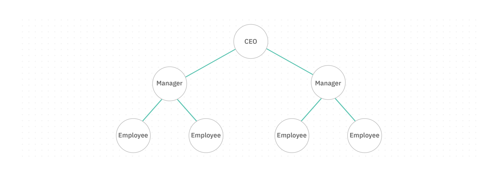
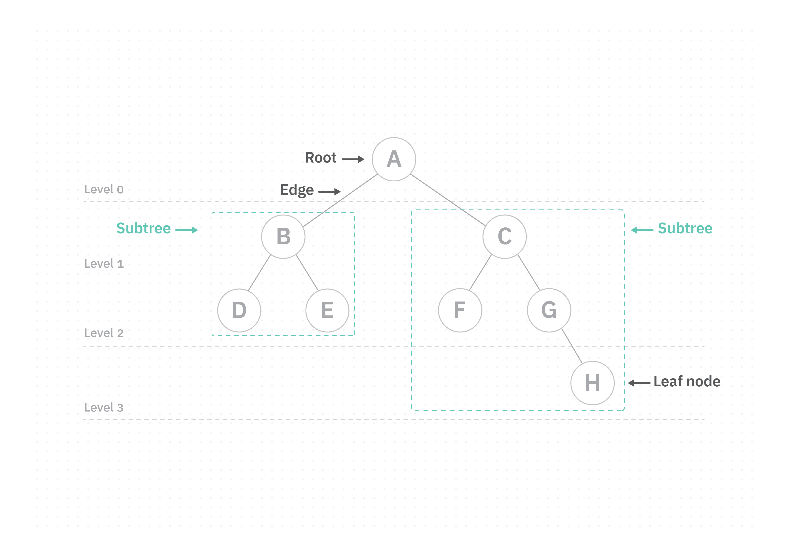
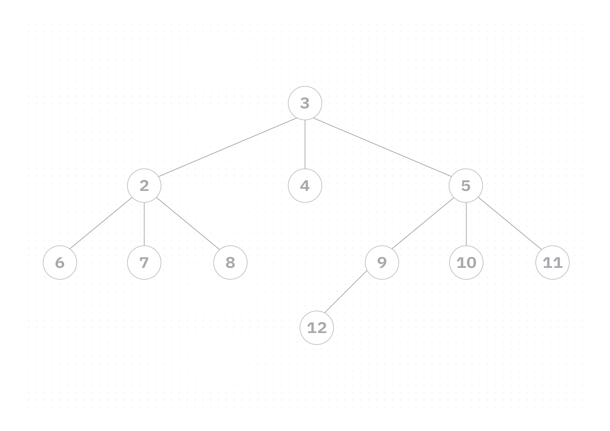
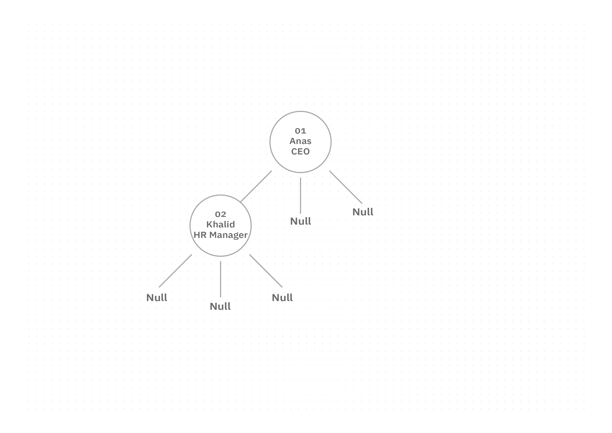
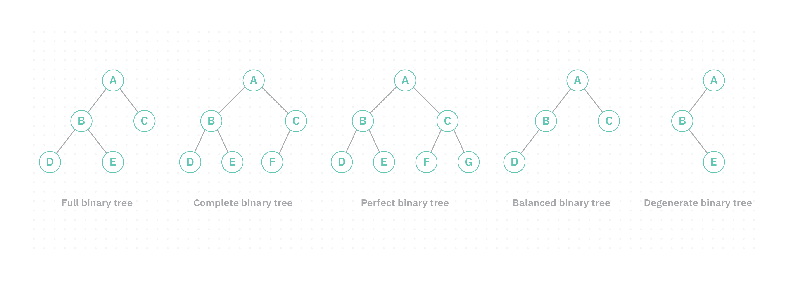
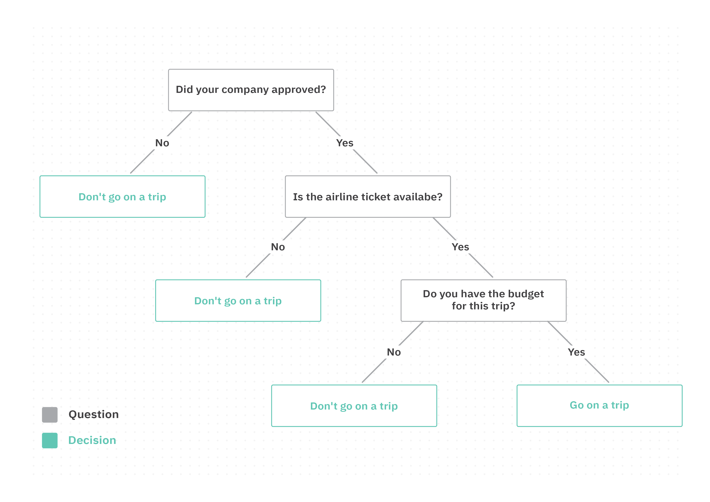

# Tree

Imagine you have a large company with a CEO, managers, and employees. How would you organize them by role and hierarchy? A flat list wouldn't capture the relationships. A **tree** is the right structure here; it naturally represents hierarchical relationships.




## Concept

A `tree` is a collection of nodes connected by edges, representing data in a **hierarchical** (non-linear) order.



**Key terminology:**

- **Root:** The topmost node of the tree.
- **Node:** An entity that contains data (keys) and references (pointers) to its child nodes.
- **Edge:** A connecting link between two nodes.
- **Parent:** A node that has at least one child.
  - Example: `B` is the parent of `D` and `E`.
- **Child:** A node that has a parent.
  - Example: `D` and `E` are children of `B`.
- **Siblings:** Nodes that share the same parent.
  - Example: `D` and `E` are siblings.
- **Leaf Node:** A node with no children.
  - Examples: `D`, `E`, `F`, and `H`.
- **Depth:** The number of edges from the root to a node.
  - Example: The depth of `B` is `1`.
- **Level:** Represents the generation of a node in the tree.
  - Root node is at **Level 0**
  - Children of the root are at **Level 1**
  - Grandchildren are at **Level 2**
  - And so on
- **Height:** The number of edges from a node to its deepest leaf along the longest path.
  - Example: The height of `A` is `3`.
- **Degree:** The total number of children a node has.
  - Degree of `A` = `2`
  - Degree of `B` = `2`
  - Degree of `G` = `1`
- **Subtree:** A node and all of its descendants form a subtree.


## Types of Tree

- **General Tree**: No constraints on structure; a node can have any number of children.
- **Binary Tree**: Each node has at most two children.
- **Binary Search Tree (BST)**: A binary tree where left subtree values are less than the node, and right subtree values are greater.
- **AVL Tree**: A self-balancing BST where the balance factor of every node is -1, 0, or 1.
- **B-Tree**: A self-balancing tree where nodes can hold more than one key and have more than two children.


## General Tree

A general tree has no constraint on the number of children per node. Each node contains data and pointers to its children.


### Implementation
For simplicity, this implementation demonstrates a tree where each node can have up to three children (left, center, and right).

#### Primitive
The `Node` slice, data, and three pointers (left, center, right):

```java
import java.util.Stack;

class Node {
    int number;
    Node left;
    Node center;
    Node right;

    Node(int number) {
        this.number = number;
        this.left = null;
        this.center = null;
        this.right = null;
    }
}
```

The `Tree` class with print and search operations:

```java
class Tree {
    Node root;

    Tree() {
        root = null;
    }

    Tree(Node root) {
        this.root = root;
    }

    public void print() {
        if (root == null) {
            System.out.println("Tree is empty");
            return;
        }
        Stack<Node> stack = new Stack<>();
        stack.push(root);
        while (!stack.isEmpty()) {
            Node current = stack.pop();
            System.out.println(current.number);
            if (current.right != null) stack.push(current.right);
            if (current.center != null) stack.push(current.center);
            if (current.left != null) stack.push(current.left);
        }
    }

    public Node search(int target) {
        if (root == null) {
            System.out.println("Tree is empty");
            return null;
        }
        Stack<Node> stack = new Stack<>();
        stack.push(root);
        while (!stack.isEmpty()) {
            Node current = stack.pop();
            if (current.number == target) return current;
            if (current.right != null) stack.push(current.right);
            if (current.center != null) stack.push(current.center);
            if (current.left != null) stack.push(current.left);
        }
        return null;
    }
}
```

Building the tree and using operations:

```java
public class Main {
    public static void main(String[] args) {
        Tree T = new Tree();
        T.root = new Node(3);

        T.root.left = new Node(2);
        T.root.center = new Node(4);
        T.root.right = new Node(5);

        T.root.left.left = new Node(6);
        T.root.left.center = new Node(7);
        T.root.left.right = new Node(8);

        T.root.right.left = new Node(9);
        T.root.right.center = new Node(10);
        T.root.right.right = new Node(11);
        T.root.right.left.left = new Node(12);

        System.out.println("Print tree values:");
        T.print();

        Node result = T.search(8);
        System.out.println("Search result: " + (result != null ? result.number : "not found"));
    }
}
```

**Output:**
```
Print tree values:
3
2
6
7
8
4
5
9
12
10
11
Search result: 8
```


#### Non-Primitive

The same tree structure using an `Employee` object as data:

```java
import java.util.Stack;

class Employee {
    int id;
    String name;
    String role;

    Employee(int id, String name, String role) {
        this.id = id;
        this.name = name;
        this.role = role;
    }
}

class Node {
    Employee data;
    Node left;
    Node center;
    Node right;

    Node(Employee e) {
        this.data = e;
        this.left = null;
        this.center = null;
        this.right = null;
    }
}

class Tree {
    Node root;

    Tree() {
        root = null;
    }

    public void print() {
        if (root == null) {
            System.out.println("Tree is empty");
            return;
        }
        Stack<Node> stack = new Stack<>();
        stack.push(root);
        while (!stack.isEmpty()) {
            Node current = stack.pop();
            System.out.println(current.data.name);
            if (current.right != null) stack.push(current.right);
            if (current.center != null) stack.push(current.center);
            if (current.left != null) stack.push(current.left);
        }
    }
}

public class Main {
    public static void main(String[] args) {
        Tree T = new Tree();
        T.root = new Node(new Employee(1, "Ahmed", "CEO"));

        System.out.println("Root: " + T.root.data.name);

        // Update root name
        T.root.data.name = "Anas";

        // Add left child
        T.root.left = new Node(new Employee(2, "Khalid", "HR Manager"));

        System.out.println("Print tree values:");
        T.print();
    }
}
```

**Output:**
```
Root: Ahmed
Print tree values:
Anas
Khalid
```




## Binary Tree

A **binary tree** is a tree where every node has **at most two children** (a left child and a right child).

**Types of binary tree:**




1. **Full Binary Tree**: Every node has either two children or no children.
2. **Complete Binary Tree**: All levels are fully filled except possibly the last, where nodes are as far left as possible.
3. **Perfect Binary Tree**: Every node has two children, and all leaves are at the same level.
4. **Balanced Binary Tree**: A binary tree whose height remains approximately balanced, preventing one side from becoming significantly deeper than the other.
5. **Degenerate Binary Tree**: Every internal node has exactly one child; essentially a linked list.

### Tree Traversal

Traversal means visiting each node to read or process its value. There are three methods:


1. **Pre-order**: Root → Left → Right. Example: `A → B → D → E → C → F → G → H`
2. **In-order**: Left → Root → Right. Example: `D → B → E → A → F → C → G → H`
3. **Post-order**: Left → Right → Root. Example: `D → E → B → F → H → G → C → A`

### Implementation

#### Primitive

The `Node` slice (data and two pointers):

```java
import java.util.Stack;

class Node {
    int data;
    Node left;
    Node right;

    Node(int data) {
        this.data = data;
        this.left = null;
        this.right = null;
    }
}
```

The `BinaryTree` class with print, search, addLeft, and addRight:

```java
class BinaryTree {
    Node root;

    BinaryTree(Node root) {
        this.root = root;
    }

    // Pre-order traversal
    public void print() {
        if (root == null) {
            System.out.println("Tree is empty");
            return;
        }
        Stack<Node> stack = new Stack<>();
        stack.push(root);
        while (!stack.isEmpty()) {
            Node current = stack.pop();
            System.out.print(current.data + " ");
            if (current.right != null) stack.push(current.right);
            if (current.left != null) stack.push(current.left);
        }
        System.out.println();
    }

    public Node search(int target) {
        if (root == null) {
            System.out.println("Tree is empty");
            return null;
        }
        Stack<Node> stack = new Stack<>();
        stack.push(root);
        while (!stack.isEmpty()) {
            Node current = stack.pop();
            if (current.data == target) return current;
            if (current.right != null) stack.push(current.right);
            if (current.left != null) stack.push(current.left);
        }
        return null;
    }

    public void addLeft(int parentData, int newData) {
        Node parent = search(parentData);
        if (parent == null) {
            System.out.println(parentData + " parent not found");
            return;
        }
        if (parent.left != null) {
            System.out.println("Parent already has a left child");
            return;
        }
        parent.left = new Node(newData);
        System.out.println(newData + " added successfully");
    }

    public void addRight(int parentData, int newData) {
        Node parent = search(parentData);
        if (parent == null) {
            System.out.println(parentData + " parent not found");
            return;
        }
        if (parent.right != null) {
            System.out.println("Parent already has a right child");
            return;
        }
        parent.right = new Node(newData);
        System.out.println(newData + " added successfully");
    }
}
```

Building and using the binary tree:

```java
public class Main {
    public static void main(String[] args) {
        BinaryTree tree = new BinaryTree(new Node(1));

        tree.addLeft(1, 2);
        tree.addRight(1, 3);
        tree.addLeft(2, 4);
        tree.addRight(2, 5);
        tree.addLeft(3, 6);
        tree.addRight(3, 7);

        System.out.print("Tree values: ");
        tree.print();
    }
}
```

**Output:**
```
2 added successfully
3 added successfully
4 added successfully
5 added successfully
6 added successfully
7 added successfully
Tree values: 1 2 4 5 3 6 7
```


## Binary Search Tree (BST)

A **binary search tree** is a binary tree that follows a specific ordering property:

1. All values in the **left subtree** are **less than** the current node.
2. All values in the **right subtree** are **greater than** the current node.
3. **Duplicate values** are not allowed.


### Implementation

#### Primitive

The `Node` slice is the same as the binary tree (data, left, and right):

```java
class Node {
    int val;
    Node left;
    Node right;

    Node(int val) {
        this.val = val;
        this.left = null;
        this.right = null;
    }
}
```

The `BinarySearchTree` class with insert, search, delete, and print:

```java
import java.util.Stack;

class BinarySearchTree {
    private Node root;

    BinarySearchTree() {
        this.root = null;
    }

    // Pre-order print
    public void print() {
        if (root == null) {
            System.out.println("Tree is empty");
            return;
        }
        Stack<Node> stack = new Stack<>();
        stack.push(root);
        while (!stack.isEmpty()) {
            Node current = stack.pop();
            System.out.print(current.val + " ");
            if (current.right != null) stack.push(current.right);
            if (current.left != null) stack.push(current.left);
        }
        System.out.println();
    }

    public void insert(int value) {
        Node newNode = new Node(value);
        if (root == null) {
            root = newNode;
            return;
        }
        Node curr = root;
        while (true) {
            if (value == curr.val) return; 
            if (value < curr.val) {
                if (curr.left == null) { curr.left = newNode; return; }
                curr = curr.left;
            } else {
                if (curr.right == null) { curr.right = newNode; return; }
                curr = curr.right;
            }
        }
    }

    public boolean search(int value) {
        if (root == null) return false;
        Stack<Node> stack = new Stack<>();
        stack.push(root);
        while (!stack.isEmpty()) {
            Node current = stack.pop();
            if (current.val == value) return true;
            if (value < current.val && current.left != null) stack.push(current.left);
            else if (value > current.val && current.right != null) stack.push(current.right);
        }
        return false;
    }

    public boolean delete(int value) {
        if (root == null) return false;

        Node curr = root;
        Node prev = null;
        boolean isLeftChild = false;

        // Find the target node and its parent
        while (curr != null) {
            if (value == curr.val) break;
            prev = curr;
            if (value < curr.val) {
                curr = curr.left;
                isLeftChild = true;
            } else {
                curr = curr.right;
                isLeftChild = false;
            }
        }

        if (curr == null) {
            System.out.println("Target not found");
            return false;
        }

        // Only handles leaf node deletion
        if (curr.left == null && curr.right == null) {
            if (prev == null) {
                root = null;
            } else if (isLeftChild) {
                prev.left = null;
            } else {
                prev.right = null;
            }
            return true;
        } else {
            System.out.println("Target { " + value + " } is not a leaf node");
            return false;
        }
    }
}
```
This simplified implementation only supports deleting leaf nodes.

Using the BST:

```java
public class Main {
    public static void main(String[] args) {
        BinarySearchTree bst = new BinarySearchTree();

        bst.insert(8);
        bst.insert(3);
        bst.insert(10);
        bst.insert(1);
        bst.insert(6);
        bst.insert(14);
        bst.insert(4);
        bst.insert(7);
        bst.insert(13);

        System.out.print("Tree values: ");
        bst.print();

        bst.delete(13);
        System.out.print("After deleting 13: ");
        bst.print();

        System.out.println("Search 14: " + bst.search(14));
    }
}
```

**Output:**
```
Tree values: 8 3 1 6 4 7 10 14 13
After deleting 13: 8 3 1 6 4 7 10 14
Search 14: true
```


## Decision Tree

A **decision tree** is an application of the binary tree. It helps a program decide between actions based on a series of yes/no questions. Each internal node is a question, and each leaf node is a decision outcome.





### Implementation

The decision tree uses `String` as node data, each node holds a question, and the leaves hold decisions:

```java
import java.util.Scanner;
import java.util.Stack;

class Node {
    String question;
    Node right;
    Node left;

    Node(String question) {
        this.question = question;
        this.right = null;
        this.left = null;
    }
}

class DecisionTree {
    Node root;

    DecisionTree(Node root) {
        this.root = root;
    }

    public Node search(String target) {
        if (root == null) {
            System.out.println("Tree is empty");
            return null;
        }
        Stack<Node> stack = new Stack<>();
        stack.push(root);
        while (!stack.isEmpty()) {
            Node current = stack.pop();
            if (current.question.equals(target)) return current;
            if (current.right != null) stack.push(current.right);
            if (current.left != null) stack.push(current.left);
        }
        return null;
    }

    public void addRight(String parentQuestion, String newQuestion) {
        Node parent = search(parentQuestion);
        if (parent == null) {
            System.out.println(parentQuestion + " parent not found");
            return;
        }
        if (parent.right != null) {
            System.out.println("Parent already has a right child");
            return;
        }
        parent.right = new Node(newQuestion);
        System.out.println(newQuestion + " added successfully");
    }

    public void addLeft(String parentQuestion, String newQuestion) {
        Node parent = search(parentQuestion);
        if (parent == null) {
            System.out.println(parentQuestion + " parent not found");
            return;
        }
        if (parent.left != null) {
            System.out.println("Parent already has a left child");
            return;
        }
        parent.left = new Node(newQuestion);
        System.out.println(newQuestion + " added successfully");
    }
}

public class Main {
    public static void main(String[] args) {
        DecisionTree decisionTree = new DecisionTree(new Node("Did your company approve your vacation?"));
        decisionTree.addRight("Did your company approve your vacation?", "Is the airline ticket available?");
        decisionTree.addRight("Is the airline ticket available?", "Do you have the budget for this trip?");

        System.out.println("---------------------------------------------");

        Node current = decisionTree.root;
        System.out.println(current.question);

        Scanner scanner = new Scanner(System.in);
        String input = scanner.nextLine();
        boolean accepted = true;

        while (current.right != null) {
            if ("yes".equalsIgnoreCase(input)) {
                current = current.right;
                System.out.println(current.question);
                input = scanner.nextLine();
            } else if ("no".equalsIgnoreCase(input)) {
                accepted = false;
                break;
            } else {
                System.out.println("Invalid input. Please answer with yes or no.");
            }
        }
        scanner.close();

        System.out.println(accepted ? "Go on trip" : "Don't go on trip");
    }
}
```

**Action 1: Go on the trip:**
```
Did your company approve your vacation?
yes
Is the airline ticket available?
yes
Do you have the budget for this trip?
yes
Go on trip
```

**Action 2: Don't go on the trip:**
```
Did your company approve your vacation?
yes
Is the airline ticket available?
no
Don't go on trip
```


## Practice

- Create a **binary tree** with root `10`.
  - Add `5` as a left child and `15` as a right child.
  - Add `3` as a left child of `5`.
  - Print the tree using **pre-order traversal**.

