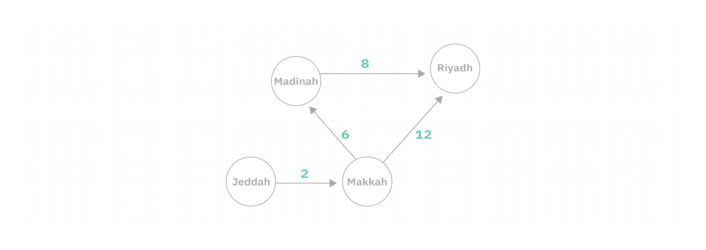
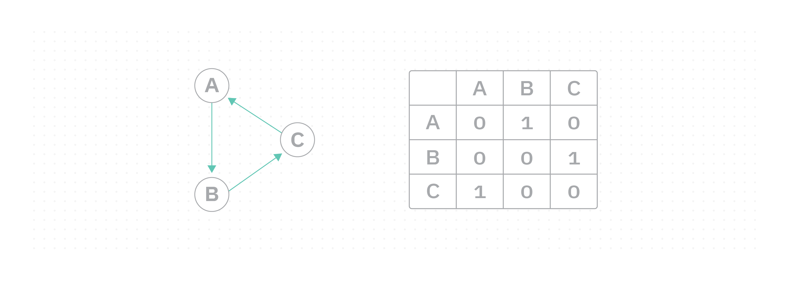
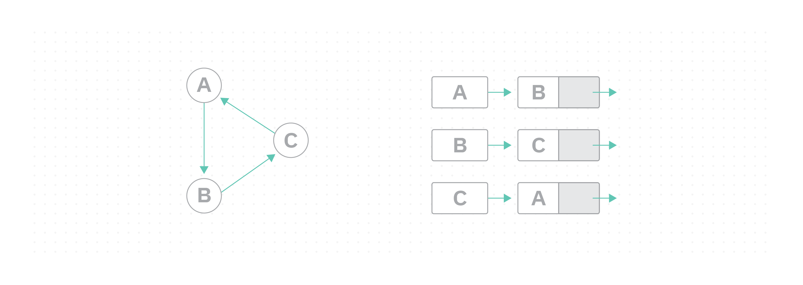

# Graph

Imagine three people: Khaled, Fahad, and Majed. Khaled knows Fahad, and Fahad knows both Khaled and Majed, but Majed doesn't know either of them. How do we store these objects and their relationships in a program?

A simple list or array can't capture this. We need a **Graph**.


## Concept

A `graph` is a **non-linear data structure** that organizes data by storing objects and the relationships between them.

- The objects in a graph are called **vertices** (also known as nodes).


- The relationships connecting two vertices are called **edges**.


>[!NOTE]
> Graphs are widely used to model real-world problems involving relationships, social networks, map navigation, recommendation systems, and more.


## Types

### Directed Graph

Edges have **one direction**; you can only travel from the source to the destination, not the other way.


> Think of it as a one-way street: you can go from A to B but not from B to A.

### Undirected Graph

Edges have **no direction**; you can travel both ways between any two connected vertices.


> Think of it as a two-way street: you can go from A to B and from B to A.

### Weighted Graph

A graph where each edge has a **value** (called weight or cost). A common example is map navigation, where vertices are cities and weights are distances between them.



## Terminology

- **Simple Graph**: an unweighted, undirected graph with no self-loops or duplicate edges.
- **In-degree**: number of edges pointing **into** a vertex (directed graphs).
- **Out-degree**: number of edges pointing **out of** a vertex (directed graphs).
- **Path**: a sequence of edges connecting two vertices.
- **Self-Loop**: an edge that connects a vertex to itself.


- **Cyclic Graph**: a graph where you can start at a vertex, follow edges, and return to the same vertex.


- **Acyclic Graph**: a directed graph with no cycles.
- **Connected Graph**: every vertex is connected to at least one other vertex.


- **Disconnected Graph**: some vertices have no edges connecting them to the rest.


- **Complete Graph**: every vertex is connected to every other vertex.


- **Subgraph**: a subset of a graph's vertices and edges.


- **Strongly Connected Graph**: a directed graph where every vertex can reach every other vertex.
- **Weakly Connected Graph**: a directed graph where all vertices are connected, but at least one vertex has no out-degree (cannot reach any other vertex).


## Graph Representation

The two most common ways to represent a graph in code are **Adjacency Matrix** and **Adjacency List**.

### Adjacency Matrix

A 2D array where rows are source vertices and columns are destination vertices. A value of `1` means there is an edge; `0` means there is not.




### Adjacency List

An `ArrayList` of `LinkedList`. Each index in the ArrayList represents a source vertex, and its linked list holds all destination vertices it connects to.

 


## Implementation

We will implement a **directed graph** using both representation methods.

### Adjacency Matrix

The `Vertex` class:

```java
class Vertex {
    char data;

    Vertex(char data) {
        this.data = data;
    }
}
```

In the `Graph` class, the constructor takes a `size` parameter to initialize the adjacency matrix with the correct dimensions:

```java
import java.util.ArrayList;

class Graph {
    ArrayList<Vertex> vertices;
    int[][] adjMatrix;

    Graph(int size) {
        vertices = new ArrayList<>();
        adjMatrix = new int[size][size];
    }

    void addVertex(Vertex vertex) {
        vertices.add(vertex);
    }

    void addEdge(int src, int dst) {
        adjMatrix[src][dst] = 1;
    }

    void removeEdge(int src, int dst) {
        adjMatrix[src][dst] = 0;
    }

    void display() {
        System.out.print("\t");
        for (int i = 0; i < vertices.size(); i++) {
            System.out.print(vertices.get(i).data + " ");
        }
        System.out.println();
        for (int i = 0; i < vertices.size(); i++) {
            System.out.print(vertices.get(i).data + "\t");
            for (int j = 0; j < vertices.size(); j++) {
                System.out.print(adjMatrix[i][j] + " ");
            }
            System.out.println();
        }
    }
}
```

Using the class:

```java
public class Main {
    public static void main(String[] args) {
        Graph graph = new Graph(2);

        graph.addVertex(new Vertex('A')); // index 0
        graph.addVertex(new Vertex('B')); // index 1

        graph.addEdge(0, 1); // A → B

        graph.display();
    }
}
```

**Output:**
```
	A B 
A	0 1 
B	0 0 
```

After calling `removeEdge(0, 1)`:

```java
graph.removeEdge(0, 1);
graph.display();
```

**Output:**
```
	A B 
A	0 0 
B	0 0 
```

>[!NOTE]
> The adjacency matrix size must be declared upfront since the 2D array needs fixed dimensions at initialization time.

### Adjacency List

The `Vertex` class is the same as above. The `Graph` class uses an `ArrayList` of `LinkedList`s:

```java
import java.util.ArrayList;
import java.util.LinkedList;

class Graph {
    ArrayList<LinkedList<Vertex>> vertices;

    Graph() {
        vertices = new ArrayList<>();
    }

    void addVertex(Vertex v) {
        LinkedList<Vertex> list = new LinkedList<>();
        list.add(v);
        vertices.add(list);
    }

    void addEdge(int src, int dst) {
        LinkedList<Vertex> list = vertices.get(src);
        Vertex dstVertex = vertices.get(dst).get(0);
        list.add(dstVertex);
    }

    void print() {
        for (LinkedList<Vertex> list : vertices) {
            for (Vertex node : list) {
                System.out.print(node.data + " -> ");
            }
            System.out.println();
        }
    }
}
```

Using the class:

```java
public class Main {
    public static void main(String[] args) {
        Graph graph = new Graph();

        graph.addVertex(new Vertex('A'));
        graph.addVertex(new Vertex('B'));
        graph.addVertex(new Vertex('C'));

        graph.addEdge(0, 1); // A → B
        graph.addEdge(1, 2); // B → C
        graph.addEdge(2, 0); // C → A

        graph.print();
    }
}
```

**Output:**
```
A -> B -> 
B -> C -> 
C -> A -> 
```


## Practice

- Create a directed graph with 3 vertices: `A`, `B`, `C`.
  - Add edges `A → B` and `B → C`.
  - Display the adjacency matrix.


